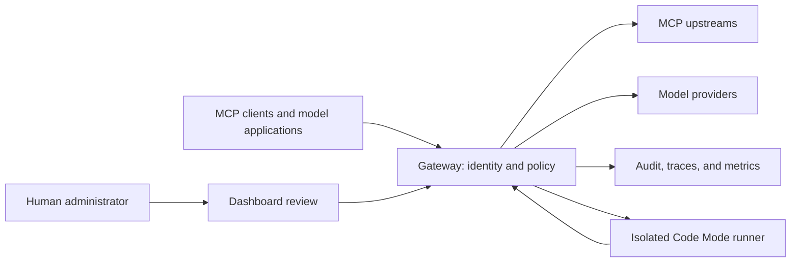

# Waygate

<picture>
  <source media="(max-width: 600px) and (prefers-color-scheme: dark)" srcset="docs/branding/assets/wordmark-on-dark.svg">
  <source media="(max-width: 600px)" srcset="docs/branding/assets/wordmark-on-light.svg">
  <source media="(prefers-color-scheme: dark)" srcset="docs/branding/assets/header-dark.svg">
  
</picture>

Waygate connects MCP clients to tools and model providers, with identity,
Cedar access policy, quotas, and audit applied at the gateway.

The gateway is useful when an assistant needs many tools, several identities or
providers, and a clear boundary for what it may do. Ordinary MCP calls remain
available alongside server-side search, file transfer, reviewed workflows, and
Code Mode orchestration.

**[Run the local tutorial](examples/quickstart/README.md)** ·
**[Explore the documentation](docs/README.md)** ·
**[Deploy with real identity](docs/configuration.md)** ·
**[Get the latest release](https://github.com/chrisbennight/waygate/releases/latest)**

Published container: `ghcr.io/chrisbennight/waygate`.
Use a [release digest](https://github.com/chrisbennight/waygate/releases/latest)
for deployment; `latest` follows stable releases and `edge` follows main.

## Try it locally

Install Docker with Compose and Python 3, then run from this checkout:

```sh
POSTGRES_PASSWORD=dev docker compose up --build --wait
python3 examples/quickstart/check.py
```

The stack builds a gateway and starts Postgres, a demonstration MCP server, and
a disposable token issuer. It needs no home-network access, model account, or
host Rust installation. The first build downloads dependencies and can take
several minutes.

Expected result:

```text
PASS: discovery exposes the permitted demo tool
Hello, world! Your request passed through the gateway.
PASS: Cedar refuses the restricted tool for the demo identity
```

This is a loopback-only learning environment. Its issuer gives anyone a token
for a fixed demo identity and its dashboard has no interactive login. Do not
expose it or use it for real data. The gateway still validates the demo token
and evaluates policy. The [tutorial](examples/quickstart/README.md) explains the
request flow, configuration, troubleshooting, and cleanup:

```sh
POSTGRES_PASSWORD=dev docker compose down --volumes
```

## What you can build

| Outcome | Capability |
| --- | --- |
| Give an assistant a large tool catalog without loading every schema at once | [Progressive discovery](docs/guides/mcp.md), exact typed inspection, and ordinary direct MCP calls. |
| Process files without pasting their bytes into model context | [Governed file transfer](docs/guides/files.md), key-bound helper grants, retained responses, and owner-scoped file references. |
| Share workflows whose contents can be reviewed and pinned | [Verified skills](docs/guides/skills.md), progressive loading, distribution approval, and direct execution of selected JavaScript helpers. |
| Filter and combine several tool results before returning an answer | [Code Mode](docs/guides/code-mode.md), isolated execution, per-call authorization, durable checkpoints, artifacts, and cancellation. |
| Express access rules beyond an API-key allowlist | [Cedar and identity](docs/guides/security.md), tenant-aware policy, directory lifecycle, step-up, federation, and enterprise authorization. |
| Let an agent prepare a gateway change for a human to approve | [Gateway administration over MCP](docs/guides/gateway-administration.md), typed action discovery, previews, captured proposals, and dashboard review. |
| Govern model requests and explain their cost or failures | [Inference routing](docs/guides/inference.md), provider adapters, usage accounting, and [correlated audit and telemetry](docs/guides/observability.md). |

## How it fits together



Each nested Code Mode call returns through the gateway's enforcement boundary.
Provider credentials stay in the gateway's authorized runtime. Deployment
repositories own manifests, policies, secret injection, storage, network routes,
and the immutable image selected for rollout.

The Rust workspace builds the gateway server and companion command-line tools.
The container is distroless and non-root. See the [architecture](docs/architecture.md)
for crate responsibilities and the request lifecycle.

## Standards and compatibility

The gateway supports MCP `2026-07-28` self-contained requests and a negotiated
legacy session path, explicitly advertising `2025-11-25` alongside the newer
version. It exposes standard tools, resources, and prompts, and preserves the
ordinary direct-call path for capable hosts.

Optional features include the official Tasks and enterprise-managed
authorization extensions. SEP-1888 search and SEP-2631 file transfer are draft
compatibility surfaces; Code Mode and the helper tools are gateway enhancements.
The [capability guide](docs/guides/mcp.md) distinguishes those categories and
links to authoritative specifications. Capability availability also depends on
configuration, caller authority, and client support.

This is an actively developed project. The guides describe implemented
workflows and their prerequisites. Durable execution does not imply automatic
rollback, integrity checks do not imply malware scanning, and usage accounting
does not guarantee a hard concurrent spending cap.

## Configuration

Use [the configuration guide](docs/configuration.md) and the authenticated
[environment template](.env.example). Replace placeholders through your
launcher or secret provider; the binary does not automatically load `.env`.
The tutorial's Compose file has its own fixed environment.

[The operator runbook](docs/operations.md) and
[authenticated Compose example](examples/deployment/README.md) cover installation,
acceptance, upgrades, and recovery. [Deployment details](docs/deployment.md)
cover storage and ingress. [Runtime settings](docs/configuration-reference.md)
and [integration compatibility](docs/integration-configuration.md) cover
optional controls and upgrade requirements. Generated administration clients
are available through [the OpenAPI workflow](docs/admin-clients.md).

## Contribute

Read [the contribution guide](CONTRIBUTING.md), [architecture](docs/architecture.md),
[design language](docs/design.md), and [repository instructions](AGENTS.md). Use the checked-in Rust toolchain and
lockfile. Core validation is:

```sh
cargo fmt --all -- --check
cargo clippy --workspace --all-targets -- -D warnings
cargo test --workspace --locked
cargo check --workspace
```

Database-backed tests require Postgres; a local run without their database
settings does not exercise that layer. CI supplies a database and also checks
the image's hardened startup and real upstream handshake.

Use [support guidance](SUPPORT.md) for bug reports and feature requests, and
[private security reporting](SECURITY.md) for vulnerabilities.
See [release notes](docs/release-notes.md) for adoption changes and
[source publication](docs/source-release.md) for artifact/version conventions.

## License

This project is licensed under the [Apache License 2.0](LICENSE-APACHE).
Contributions submitted for inclusion are licensed under the same terms.

Required notices for bundled browser assets, fonts, and Rust dependencies are
included in [Third-party licenses](THIRD_PARTY_LICENSES.md).
