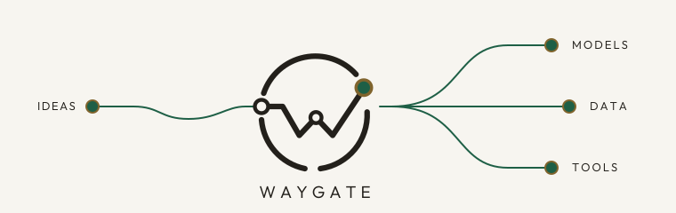
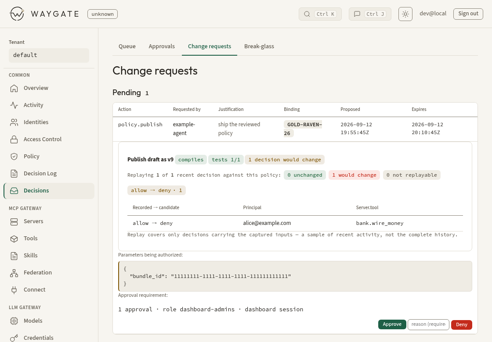

# Waygate

<picture>
  <source media="(max-width: 600px) and (prefers-color-scheme: dark)" srcset="docs/branding/assets/wordmark-on-dark.svg">
  <source media="(max-width: 600px)" srcset="docs/branding/assets/wordmark-on-light.svg">
  <source media="(prefers-color-scheme: dark)" srcset="docs/branding/assets/header-dark.svg">
  
</picture>

Connect your MCP servers and model providers to Waygate. Your agents can find
tools as they need them, combine calls into workflows, and propose changes for
you to approve. You control access and can inspect what happened.

**[Run the local tutorial](examples/quickstart/README.md)** ·
**[Explore the documentation](docs/README.md)** ·
**[Deploy with real identity](docs/configuration.md)** ·
**[Get the latest release](https://github.com/chrisbennight/waygate/releases/latest)**

<picture>
  <source media="(prefers-color-scheme: dark)" srcset="docs/images/policy-review-dark.png">
  
</picture>

Review an agent's proposed policy change and see its effect on recent calls
before approving it. Full size: [light](docs/images/policy-review-light.png) ·
[dark](docs/images/policy-review-dark.png).

## Things to try

**Find the right tool without loading the whole catalog.** Connect several MCP
servers for your code host, logs, or documentation. An agent can search across
them and load the definition it needs. Waygate checks access when tools are
discovered and again when they are called.
[Explore tool discovery](docs/guides/mcp.md).

**Check the builds, return the failures.** With your code host connected, an
agent can use Code Mode to check CI across repositories and return only the
jobs that need attention. The intermediate responses can stay outside the
model's context, and each call still passes through the gateway's access
checks. [Combine tool calls](docs/guides/code-mode.md).

**Let an agent prepare the change.** An agent can propose a gateway change
without receiving the authority to approve it. Inspect the captured change in
the dashboard, approve or deny it, and let the agent follow the result.
[Try the approval workflow](docs/guides/gateway-administration.md).

## Quick start (local)

Install Docker with Compose and Python 3, then run from this checkout:

```sh
POSTGRES_PASSWORD=dev docker compose up --build --wait
python3 examples/quickstart/check.py
```

The stack builds a gateway and starts Postgres, a demonstration MCP server, and
a disposable token issuer. It needs no home-network access, model account, or
host Rust installation. The first build downloads dependencies and can take
several minutes.

Expected result:

```text
PASS: discovery exposes the permitted demo tool
Hello, world! Your request passed through the gateway.
PASS: Cedar refuses the restricted tool for the demo identity
```

This is a loopback-only learning environment. Its issuer gives anyone a token
for a fixed demo identity and its dashboard has no interactive login. Do not
expose it or use it for real data. The gateway still validates the demo token
and evaluates policy. The [tutorial](examples/quickstart/README.md) explains the
request flow, configuration, troubleshooting, and cleanup:

```sh
POSTGRES_PASSWORD=dev docker compose down --volumes
```

## Go further

Published container: `ghcr.io/chrisbennight/waygate`. Use a
[release digest](https://github.com/chrisbennight/waygate/releases/latest) for
deployment; `latest` follows stable releases and `edge` follows main.

The [documentation](docs/README.md) covers files, models, reusable workflows,
identity, deployment, and operations. See the [architecture](docs/architecture.md)
for how the gateway fits together and the [MCP guide](docs/guides/mcp.md) for
client support.

[Contribute](CONTRIBUTING.md) · [Get help](SUPPORT.md) ·
[Report a vulnerability](SECURITY.md) · [Release notes](docs/release-notes.md)

## License

This project is licensed under the [Apache License 2.0](LICENSE-APACHE).
Contributions submitted for inclusion are licensed under the same terms.

Required notices for bundled browser assets, fonts, and Rust dependencies are
included in [Third-party licenses](THIRD_PARTY_LICENSES.md).
