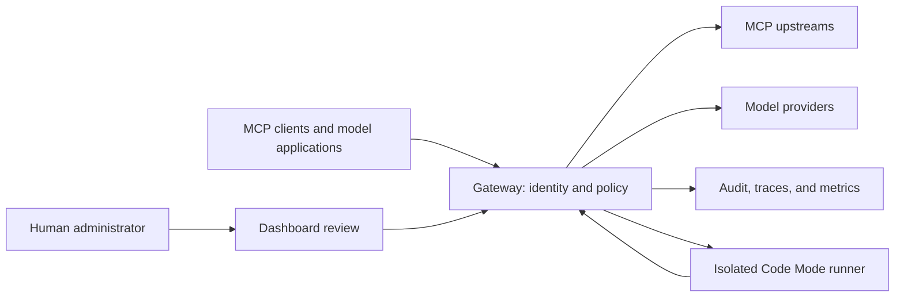

# Architecture

This document defines crate ownership, dependency direction, shared abstractions,
and the request lifecycle. CI enforces the crate map and dependency rules.
Domain-specific guidance lives in [`docs/agents/`](agents/).

## How it fits together

Each nested Code Mode call returns through the gateway's enforcement boundary.
Provider credentials stay in the gateway's authorized runtime. Deployment
repositories own manifests, policies, secret injection, storage, network routes,
and the immutable image selected for rollout.

## §1 Layering rule & dependency direction

The contract:

> **Domain and shared types live in leaf crates — `waygate-core` first.**
> **`waygate-mcp` is the MCP protocol surface, not a type hub.**
> **Nothing depends on `waygate-admin` except `waygate-server`** (and
> `waygate-test-support`, the dev-only crate that builds test fixtures
> over `AdminState` — itself consumed by nothing but `[dev-dependencies]`).
> **`waygate-server` is the only composition root.**

Intra-workspace dependencies (from `cargo metadata --no-deps`,
dev-dependencies excluded), grouped bottom-up. A crate may depend on any
crate in its own or a lower group, never higher — **CI-enforced** by
`scripts/check-dependency-direction.sh`, which reads the layer assignment
from §2's crate map (this doc is the source of truth):

- **Leaf** (no intra-workspace deps): `waygate-core`, `waygate-telemetry`,
  `waygate-policy`, `waygate-manifest-store`, `waygate-llm-providers`,
  `waygate-llm-discovery`, `waygate-test-client`, `waygate-files-helper`.
- **Foundation** (deps ⊆ {core, telemetry}): `waygate-oidc`,
  `waygate-quota`, `waygate-changeset`, `waygate-dashboard-stores`,
  `waygate-codemode`, `waygate-llm-credentials`, `waygate-catalog`,
  `waygate-manifest-types`, `waygate-skills`.
- **Domain** (everything else below the composition crates):
  `waygate-evidence`, `waygate-apikeys`, `waygate-rbac`, `waygate-scim`, `waygate-tenants`,
  `waygate-federation`, `waygate-invocation`, `waygate-llm-translate`,
  `waygate-llm-dispatch`, `waygate-agent`, `waygate-agent-runtime`,
  `waygate-authz`, `waygate-mcp`, `waygate-transfer`,
  `waygate-storage`, `waygate-as`, `waygate-upstream`.
- **Composition**: `waygate-admin`,
  `waygate-server` (the binary), `waygate-test-support` (dev-only:
  consumed exclusively via `[dev-dependencies]`, which the direction
  tripwire exempts).

### Known violations — debt, not precedent

No known layering violations. Any exception must identify the affected dependency,
its reason, and the condition for removing it.

## §2 Crate map

One row per workspace member. **CI enforces this table**: a new crate must
add its row, a deleted crate must remove it
([`scripts/check-architecture-doc.sh`](../scripts/check-architecture-doc.sh)).
The "does not own" column defines responsibility boundaries. Read it before
extending a crate.

> **Naming trap:** `waygate-authz` / `waygate-policy` / `waygate-rbac` are
> three *different* layers — the Cedar **engine**, durable policy **bundle
> storage**, and **role storage** respectively. The names suggest overlap
> that does not exist.

<!-- crate-map:begin -->
| Crate | Layer | Owns | Does not own |
| --- | --- | --- | --- |
| `waygate-core` | Leaf | Shared domain types (tool facts, `RiskTier`, `TenantId`, `InvocationHierarchy`) and the shared foundations of §5: `html`, `fmt`, `page`, `net`, `http_client` (feature `http`) | Business logic; anything needing a heavy dependency |
| `waygate-telemetry` | Leaf | OTel bootstrap: tracing subscriber, meters, span helpers | Domain types |
| `waygate-policy` | Leaf | Durable versioned Cedar policy **bundles** (storage + history) | Policy evaluation (`waygate-authz`) |
| `waygate-manifest-store` | Leaf | Durable versioned upstream-manifest bundles — the history/rollback ledger (stores YAML text) | Manifest parsing/types (`waygate-manifest-types`) |
| `waygate-llm-providers` | Leaf | Outbound transport to LLM providers: POST a pre-rendered body, return the response or SSE stream | Translation, credentials, orchestration |
| `waygate-llm-discovery` | Leaf | Fetching a provider's live model list | Catalog persistence (`waygate-storage`) |
| `waygate-test-client` | Leaf | CLI test client for OAuth-protected MCP gateways (CIMD + loopback callback UX) and the independent streaming file-host proof | Production code paths; production file-transfer authority or storage |
| `waygate-files-helper` | Leaf | The `mcp-files` CLI: holds the caller's transfer signing key, redeems a `gateway-files.prepare_*` grant over HTTPS, and streams the bytes | MCP protocol traffic; gateway login or any gateway credential; deciding whether a transfer is allowed |
| `waygate-oidc` | Foundation | OAuth 2.1 **resource-server** primitives: `Principal`, JWT validation, JWKS, session cookies, the shared AEAD envelope (`aead`), the upstream-token keyring (`upstream_crypto`), and the Tier-A upstream-session seam traits/types (`upstream_session`) | The AS role (`waygate-as`); seam *implementations* (`waygate-as`) |
| `waygate-quota` | Foundation | Per-tenant token-bucket rate limiting (`QuotaService`) | — |
| `waygate-changeset` | Foundation | The HITL change-request state machine (pending→approved→executed) and the `ActionExecutor` contract | Executor implementations (registered by `waygate-admin`) |
| `waygate-dashboard-stores` | Foundation | Small per-tenant dashboard-backing stores, one self-contained module each: `inspection_rules`, `agent_config`, `activity_saved_views` + `playground_scenarios` (upserts are atomic **JSONB shallow-merge**, pinned by pg tests), `scim_provisioning_log` | Response inspection, agent execution, and SCIM ingestion; stored custom inspection rules are not enforced |
| `waygate-codemode` | Foundation | Durable Code Mode execution state, fenced worker claims, append-only execution history | MCP wire tools, skill catalog resolution, and runner orchestration (`waygate-server`); client-facing MCP Tasks projection |
| `waygate-llm-credentials` | Foundation | Inference-plane provider credential management (Infisical-injected env) | Dispatch, translation |
| `waygate-catalog` | Foundation | Governed catalog of upstream servers/tools/versions/classifications/approvals/drift | Live connections (`waygate-upstream`) |
| `waygate-evidence` | Domain | Shared audit/evidence types (`AuditEvent`, `EvidenceRecorder`, sinks) and the inference-plane seam traits (`LlmCache`, `LlmUsageRecorder`, `LlmBudgetGate`) | Trait implementations (`waygate-storage`) and emission policy (the fifteen-stage invocation pipeline) |
| `waygate-manifest-types` | Foundation | Upstream-manifest types (`UpstreamManifest`, `Transport`, session/auth/mTLS config), the parse/serialize/load/write helpers, and `validate_manifest_invariants` (the single validation source of truth) | Dialing/transports (`waygate-upstream`); bundle persistence (`waygate-manifest-store`) |
| `waygate-skills` | Foundation | Immutable Agent Skills metadata snapshots, lazy resource-loader seam, validation, optional Code Mode compatibility test hints, content-bound approval identities, durable tenant-scoped distribution review decisions, and last-known-good publication | MCP wire methods (`waygate-mcp`); direct Git access, environment wiring, and refresh orchestration (`waygate-server`); script execution (`waygate-server` Code Mode) |
| `waygate-apikeys` | Domain | Static `mcpgw_` API keys → `Principal` for headless callers | Session/JWT auth (`waygate-oidc`) |
| `waygate-rbac` | Domain | Role storage + resolver (roles, assignments, group mappings) | Authorization decisions (`waygate-authz`) |
| `waygate-scim` | Domain | SCIM 2.0 Users/Groups ingestion store (RFC 7643/7644 subset) | — |
| `waygate-tenants` | Domain | Canonical tenant registry | — |
| `waygate-federation` | Domain | Tier-C gateway-to-gateway federation: peer registry, JWKS cache, `PeerJwtValidator` | — |
| `waygate-transfer` | Domain | Short-lived file-transfer grants and credentials, saved-file metadata, streaming file storage, cleanup, and fixed transfer routes | MCP/SEP wire translation (`waygate-mcp`); choosing and running file scanners |
| `waygate-invocation` | Domain | The `InvocationService` trait and transport-neutral `InvocationRequest` — the seam every per-tool-call hop flows through | The default implementation (`waygate-mcp`) |
| `waygate-llm-translate` | Domain | OpenAI-shaped client surfaces ↔ provider-neutral canonical model; `InferenceRecord` | Transport (`waygate-llm-providers`) |
| `waygate-llm-dispatch` | Domain | One LLM call end-to-end: resolve credential → render → invoke → record | — |
| `waygate-agent` | Domain | The in-process bounded LLM ↔ tool agent loop and its trait seams | The concrete model/dispatch/gate impls (`waygate-agent-runtime`) |
| `waygate-agent-runtime` | Domain | The concrete impls of `waygate-agent`'s seams: `OpenAiAgentModel`, `UpstreamAgentDispatch`, `ChatApprovalGate`, and the in-chat approval rendezvous | HTML/askama; anything Composition-layer (`waygate-admin` consumes it, never the reverse) |
| `waygate-authz` | Domain | The Cedar **engine** (`AuthzEngine`), entity model, step-up semantics, break-glass gate | Policy bundle storage (`waygate-policy`); role storage (`waygate-rbac`) |
| `waygate-mcp` | Domain | MCP protocol surface: canonical governed discovery records over upstream and built-in definitions, standard catalog/dispatch, the versioned gateway-owned closed-draft `searchTools` compatibility adapter, the draft SEP-2640 Skills list/get/resource projection, draft SEP-2631 file types and method translation, the fifteen-stage invocation pipeline, and the trait seams `UpstreamCatalog` / `AuthzGate` | File storage and credentials; retrieval indexes as catalog authority; requiring upstreams to implement compatibility adapters; audit/evidence and inference-seam types (`waygate-evidence` — this crate re-exports them for compat) |
| `waygate-storage` | Domain | Audit/observability persistence: audit sink + hash chain + verification, ECS/OCSF export, retention/rollups/sweeps, syslog/exporter/outbox, LLM cache/usage/budgets/catalog, agent conversations | Audit/evidence domain types (`waygate-evidence`) and emission policy (callers choose required vs best-effort recording) |
| `waygate-as` | Domain | The optional built-in OAuth 2.1 **Authorization Server**: CIMD client registration, PKCE, consent, and the upstream-session store + refresher implementing the `waygate_oidc::upstream_session` seam | Resource-server validation and the seam's types (`waygate-oidc`, re-exported here for compat) |
| `waygate-upstream` | Domain | Upstream MCP connection pool: transports (streamable HTTP / SSE / stdio), health, session identity | Manifest types/parsers (`waygate-manifest-types` — re-exported here for compat); manifest *history* (`waygate-manifest-store`) |
| `waygate-test-support` | Composition | Shared test infrastructure (dev-dependency ONLY): the `pool_or_skip` live-Postgres preamble, the canonical `Fake*`/`InMemory*` mock set (one per trait), and the `base_admin_state` core behind the dashboard test builders | Production code — no crate may list it in `[dependencies]` |
| `waygate-admin` | Composition | Admin REST API, htmx dashboard, change-executor registry, contextual assistant | New shared types (put them in `waygate-core`); being depended on by anything except `waygate-server` (and the dev-only `waygate-test-support`) |
| `waygate-server` | Composition | The binary: env config (`config.rs`), wiring/routing, reload subsystem, built-in MCP tools, healthcheck | Reusable logic — if two things need it, it belongs in a library crate |
<!-- crate-map:end -->

## §3 Request lifecycle (data plane)

The hot path for one tool call:

1. **Ingress** — axum router assembled in
   [`waygate-server/src/main.rs`](../crates/waygate-server/src/main.rs)
   (top-level tower middleware: `TraceLayer` + trailing-slash
   normalization; surface-specific layers such as the AS router's CORS
   live on their sub-routers).
2. **Authentication** — the gateway is always an OAuth 2.1 *resource
   server*: bearer JWT → `waygate-oidc` validation → `Principal`; or a
   static `mcpgw_` key → `waygate-apikeys` → `Principal`. One `Principal`
   model everywhere — borrow it, never duplicate it.
3. **MCP dispatch** —
   [`waygate-mcp/src/server.rs`](../crates/waygate-mcp/src/server.rs). A
   2026 `tools/list` traverses the stable, authorization-filtered direct-tool
   catalog with opaque cursors. Successful upstream publication and policy
   swaps bracket their serving-state mutation and advance one shared catalog
   epoch; rejected or byte-identical reloads keep the last-known-good view and
   remain quiet. Standard `tools/list` and gateway discovery retry any read
   that overlaps a publication, remote durable generation change, or
   authoritative per-tool store failure; sustained instability returns a
   retryable error rather than an incomplete projection. Cursors bind the
   authorized view and reject cross-generation traversal.
   Legacy sessions retain the gateway-owned
   `searchTools` compatibility projection; discovered tools are invoked as
   `<server>.<tool>`. Upstream `resources/list` pages and `resources/read`
   results retain their original URIs and pass through the same authenticated
   server-visibility boundary, followed by dedicated Cedar `ListResources` or
   `ReadResource` authorization. Tool-confined profiles expose no native
   resources, and reads authorize a `Resource` entity carrying the exact URI.
   Resource declarations bind a literal URI prefix to one upstream and a risk
   tier, allowing direct routing and ordinary step-up policy. Undeclared
   upstreams retain bounded catalog-enumeration fallback for compatibility.
   Resolution always completes before authorization and fails closed on URI
   collisions.
4. **The invocation pipeline** — every per-tool-call hop flows through the
   `InvocationService` trait (`waygate-invocation`); the default MCP-tool
   implementation runs fifteen ordered stages in
   [`waygate-mcp/src/invocation/mod.rs`](../crates/waygate-mcp/src/invocation/mod.rs):
   the ordered contract is the marked table below, checked against the stable
   identifiers owned by `InvocationStage::ALL`. Early gates record their own
   refusal and return before later stages. New per-call logic is a new stage
   (or an extension of one), never a bypass.

<!-- invocation-stages:begin -->
| Order | Stage ID | Status | Responsibility |
| --- | --- | --- | --- |
| 1 | `resolve_tool` | `active` | Admit one immutable tool snapshot carrying governed facts, authority, catalog identity, schema hash, and schemas; refuse quarantine before dispatch. |
| 2 | `validate_input` | `active` | Require the admitted input schema to have the MCP object root, compile it, and validate request arguments before authorization, quota, approval, evidence, or dispatch. |
| 3 | `extract_facts` | `active` | Assemble typed Policy Information Point facts from the principal and resolved classification. |
| 4 | `authorize` | `active` | Authorize the call with Cedar and stop on deny or step-up. |
| 5 | `check_profile_restrictions` | `active` | Enforce authenticated caller server/tool restrictions before consuming quota. |
| 6 | `prepare_output_validation` | `active` | Compile the admitted output schema only after Cedar and profile authorization succeed; refuse invalid schemas before quota, approval, evidence, or dispatch. |
| 7 | `check_quota` | `active` | Check and consume invocation quota when a quota service is configured. |
| 8 | `check_approval` | `active` | Enforce governed human-approval requirements before pre-call evidence or dispatch. |
| 9 | `record_pre_call` | `active` | Record required pre-call evidence for side-effecting calls in fail-closed audit mode. |
| 10 | `prepare_file_inputs` | `active` | Stream annotated gateway files to the selected upstream and replace their gateway URIs with upstream-private references. |
| 11 | `dispatch` | `active` | Dispatch the call and resolve recognized retained responses within the originating upstream session for reads and mutations. Bound retrieval by the selected runtime or file-storage delivery budget independently of caller authorization. |
| 12 | `inspect_response` | `active` | Inspect the response and redact or block before it can be forwarded. |
| 13 | `prepare_file_outputs` | `active` | Stream upstream files into temporary storage and replace their private URIs. |
| 14 | `validate_output` | `active` | Validate the inspected response against the admitted output schema. |
| 15 | `record_outcome` | `active` | Record the final invocation outcome and latency evidence. |
<!-- invocation-stages:end -->

Stage 1 uses admission semantics. `InvocationToolSnapshot` is the only governed
tool view later MCP stages may consume: authorization reads its facts, HITL uses
its admitted catalog `tool_id`, and output validation uses its admitted schema.
A catalog update affects calls that enter Stage 1 afterward; it cannot replace
the schema or approval identity of a call already in flight. Stage 11 hands
the snapshot's contract identity to `UpstreamCatalog::call_tool`, and the pool
re-resolves the tool under the selected connection's read lock, refusing
retryably when the identity no longer matches — a mid-call reload therefore
surfaces as a refused dispatch, never as an RPC executed under a contract the
earlier stages did not validate. Existing upstream
session-generation and tombstone checks may still refuse dispatch, but they do
not turn required response validation into a silent skip. Production attaches
the catalog only after boot reconciles the exact accepted manifest set; that
attachment is authoritative, so a catalog miss or read failure refuses dispatch
rather than reviving a withdrawn tool through manifest fallback. Transitional
and catalog-less compositions retain their explicit non-authoritative manifest
behavior. An authoritative miss is an intentional lifecycle block; a catalog
store failure is reported as retryable `catalog_unavailable`, not as a policy
denial. The catalog output schema travels uncompiled through Cedar and profile
authorization so a denied caller cannot distinguish malformed catalog state.
Stage 6 then compiles it and stores the resulting
`Arc<jsonschema::Validator>` in the snapshot before quota or any later
side-effecting gate. One process-wide fixed-capacity FIFO cache is injected into
every per-session MCP invocation service and the admin try-it service. Catalog
entries are keyed by `tool_id`, catalog `schema_hash`, and a canonical
validator-schema digest; manifest fallback entries use their qualified tool
identity plus the same schema-value digest. This shares validators across calls
while bounding total historical versions for the process. The separate digest
is required because the catalog hash covers only the tool name,
description, and input schema, not output schema. Compilation failures are
cached for that exact key and refuse the authorized call before dispatch; they
never turn response validation into a silent skip. Compilation uses per-key
convergence after releasing the cache's global lookup/eviction mutex, so one
miss does not block unrelated hits. When the cache is full, a new miss waits for
the oldest entry to finish compiling before FIFO eviction rather than splitting
that in-flight key across two validators.

Input schemas travel in the snapshot and Stage 2 first enforces MCP's required
object root, then compiles them through the same bounded validator cache. Legacy
manifest-imported catalog rows carry no schema,
so `UpstreamPool` completes the immutable invocation snapshot from the connected
upstream's published `tools/list` contract; a catalog-backed call fails closed
when neither source supplies an input schema. Missing arguments validate as an
empty object while retaining their original dispatch shape. Unavailable or
invalid schemas and argument violations fail before authorization, quota,
approval, evidence, or dispatch. Client and audit reasons contain schema-side
rule metadata only, including schema-declared required-field names—never
argument values, caller-controlled object keys, or instance paths.

### Tool metadata authority

The gateway separates an upstream's behavioral claims from deployment policy.
This is a hard architectural boundary:

| Fact | Producer | Enforcement authority |
|---|---|---|
| Input/output schemas | MCP server | Gateway validation and catalog approval |
| Core behavior hints | MCP server `Tool.annotations` | Gateway normalization, behavior-hash drift, Cedar facts |
| Action metadata | Experimental `io.modelcontextprotocol/action-metadata` claim | Gateway normalization, behavior-hash drift, Cedar/approval policy |
| Result sensitivity/trust | Experimental `io.modelcontextprotocol/trust-annotations` claim | Gateway result-release and propagation policy |
| Risk tier, roles | Gateway catalog/control plane | Gateway catalog and Cedar |
| Approval requirement | `requiresReview` action-metadata claim in annotation mode and the gateway catalog flag; `approval_mode: policy_only` explicitly suppresses those ordinary sources for one upstream | Gateway HITL grant gate and Cedar approval overlay |

Annotations never grant access. They are claims from a server and the
[MCP tools specification](https://modelcontextprotocol.io/specification/2026-07-28/server/tools)
requires clients to treat them as untrusted unless the server is trusted. The
gateway preserves the claim, binds it into the immutable invocation contract,
and applies locally reviewed policy to it. It does not infer `risk` from the
claim and it does not accept a server-provided risk override.

Data sensitivity is a policy input, not a reason to amputate a typed
capability. Bounded configuration, log, and secret operations remain governable
only when they pass through the gateway. Removing them from an MCP server
encourages unaudited direct-service or credential-store workarounds and is
contrary to this architecture. Security and reliability controls exist to make
the capability dependable and governable; a control that eliminates the useful
operation has failed the architecture.

`classification_mode: manifest` is the compatibility default.
`classification_mode: mcp_annotations` selects the MCP-native claim source and
admission contract. In that mode, the runtime derives `side_effects` from
`!readOnlyHint` and derives input/output protection from action-metadata
sensitivity. The catalog remains authoritative for `risk` and may add an
approval requirement; the server cannot lower either. A namespaced action claim
is currently accepted from
`Tool._meta` because the pinned rmcp type cannot retain extension keys in
`ToolAnnotations`; this bridge is normalized to the same value as the future
canonical annotation location. Missing or malformed metadata fails closed. The
live behavior hash covers both schemas and security metadata and must equal the
catalog-imported `approved_behavior_hash`, so an unknown or metadata-only
change is never published while it awaits review. Catalog rows created before
this mode retain `manifest` by database default.

The action and trust namespaces come from the MCP Tool Annotations Interest
Group's experimental repository. They are deliberately treated as versioned
claims, not stable authorization semantics:

- [`action-metadata` draft](https://github.com/modelcontextprotocol/experimental-ext-tool-annotations/blob/main/specification/draft/action-metadata.mdx)
- [`trust-annotations` draft](https://github.com/modelcontextprotocol/experimental-ext-tool-annotations/blob/main/specification/draft/trust-annotations.mdx)

Annotation-native sensitivity classifiers are intentionally open strings.
`none`, `public`, and `operational` are non-sensitive; an unknown classifier is
treated as protected until policy is updated, not rejected as an unsupported
capability. The historical Cedar `pii` fact temporarily carries
`input_sensitive || output_sensitive` so existing policy infrastructure can
govern the claim without inventing another private classification system.

Every successful annotation-native result must include explicit boolean
`sensitive` and `untrusted` trust annotations. Missing or malformed labels are
withheld. A sensitive result is released only when the admitted tool contract
declared protected output and Cedar authorized that contract. The complete
trust object remains on the result, including `untrusted` and future members,
so downstream consumers receive the server's claim rather than a gateway
rewrite.

Approval grants bind principal, tool identity, expiry, normalized arguments,
and the admitted behavior hash. A metadata or schema change therefore
invalidates an old grant without making typed operations depend on a brittle
name allowlist.

`approval_mode` is deployment policy, never an upstream-name convention. Its
default, `per_call`, honors annotation and catalog approval requirements.
`policy_only` is an explicit opt-in for deployments that govern the complete
side-effecting surface through Cedar service policy; it suppresses only those
two ordinary sources and does not grant access or disable a Cedar approval
overlay.

5. **The trait seams** — the pipeline's principal cross-crate seams are
   `UpstreamCatalog` and `AuthzGate` (defined in `waygate-mcp`) plus
   `EvidenceRecorder` (defined in `waygate-evidence`). Optional injected
   collaborators supply quotas, approval grants, response inspectors, and
   inference dispatch without moving ownership into the composition root:
   `UpstreamCatalog` ([`catalog.rs`](../crates/waygate-mcp/src/catalog.rs))
   → the `waygate-upstream` pool
   ([`pool/mod.rs`](../crates/waygate-upstream/src/pool/mod.rs));
   `AuthzGate` ([`authz.rs`](../crates/waygate-mcp/src/authz.rs)) → the
   `waygate-authz` Cedar engine;
   `EvidenceRecorder` ([`waygate-evidence/src/audit.rs`](../crates/waygate-evidence/src/audit.rs))
   → the `waygate-storage` audit sink.

Two adjacent planes:

- **Control plane** — the admin REST API + dashboard (`waygate-admin`).
  Mutations audit through the same `EvidenceRecorder`; privileged changes
  can route through the `waygate-changeset` HITL machine (propose →
  human approval → server-side execution) instead of executing directly.
- **AS plane** — with `GATEWAY_AS_ENABLED=true` the gateway also runs its
  own Authorization Server (`waygate-as`). See
  [`docs/agents/identity.md`](agents/identity.md).

## §4 State model & reload

Where each kind of state lives and how it changes:

- **Postgres** — the durable store. `migrations/` is append-only and
  immutable once shipped; one file per version, numbered against latest
  `main` ([`docs/agents/migrations.md`](agents/migrations.md) — the rules
  there are load-bearing; three CI guards enforce them). Each store crate
  owns its tables (the crate map says which). When
  `GATEWAY_DATABASE_URL` is unset the gateway boots with a null audit sink
  and a `WARN` — never flip that default to panic.
  Code Mode's content-addressed source artifacts are private ephemeral rows in
  that store: owner identity includes tenant, issuer, and subject; callers may
  retain exact resolved UTF-8 source for at most 24 hours; no listing surface
  exists; operator-configured live count and byte quotas default to 64 sources / 64 MiB
  per owner and 1,024 sources / 1 GiB per tenant; byte defaults derive from the
  configured source limit; and expiry is independent of the
  execution journal that already owns an admitted continuable program. Durable
  file-backed starts keep a separate owner-scoped, fixed-width
  upload-locator-to-content-digest binding for the journal lifetime; it stores
  no source body, has no listing surface, and is capped at 256 live rows per
  owner / 4,096 per tenant. The binding recovers retries only; fresh work or a
  source-retention extension must resolve a currently live source selector.
- **Served configuration** — upstream manifests (`GATEWAY_SERVERS_DIR`)
  and Cedar policies (`GATEWAY_POLICIES_DIR`) are directories on the
  deployment volume, not baked into the image. **SIGHUP reloads both; a
  broken file must never lock the operator out** — reload logs the error
  and keeps the previous set. Preserve that invariant in any loader change.
- **External Agent Skills** — the configured Git repository is the source of
  truth. Each immutable in-memory metadata snapshot represents one resolved
  commit; the gateway fetches individual blobs on demand. A failed initial or periodic
  refresh does not affect gateway readiness; after a snapshot exists, failure
  leaves that last accepted snapshot active. No checkout, repository mirror,
  package copy, or persistent skill cache belongs in the gateway.
  Standard skill tools and prompt shortcuts share the same governed reader.
  The current and four previous distinct metadata snapshots remain available
  in process memory so active workflows can request a consistent revision;
  unavailable revisions fail explicitly rather than substituting new content.
  Distribution decisions are durable and tenant-scoped. Pending replacements
  preserve approved serving content; explicit quarantine blocks retained reads.
  After restart, the latest approved metadata can be restored from its recorded
  Git commit, verified against the decision, and held in the same bounded cache.
  Every content release rechecks approval; distribution approval grants no script
  execution authority. See [skill distribution review](skill-distribution-review.md).
- **Upstream tool review** — the governed catalog retains the accepted and
  observed contract plus durable quarantine per tool. Replacement connections
  record observations before publication. Discovery and dispatch consult this
  refusal state; exact-generation acceptance uses the existing admin action
  registry and preserves manifest authority for annotation-mode hashes.
  See [tool change review](guides/security.md#review-an-upstream-tool-change).
- **In-memory caches** — JWKS (per-issuer in `waygate-oidc`; per-peer with
  a generation fence in `waygate-federation`), session state, the upstream
  connection pool, quota buckets. All rebuildable; none is a source of
  truth.
- **Environment config** — read once at boot by `from_env()` in
  [`waygate-server/src/config.rs`](../crates/waygate-server/src/config.rs).
  **New `GATEWAY_*` variables are read there, not inline at point of use**
  — scattered `env::var` calls are how config drift starts. The
  `scripts/check-env-parsing.sh` CI tripwire rejects new reads outside the
  centralized configuration path.

## §5 Shared foundations — use these, never hand-roll

The anti-photocopy table. Before writing any of these shapes, use the
shared module; CI fails on new local copies where a tripwire exists.

| Shape | Use | Tripwire |
| --- | --- | --- |
| HTML escaping (hand-built HTML only; askama auto-escapes templates) | `waygate_core::html::escape` | `check-no-local-escapers.sh` |
| AEAD envelope (AES-256-GCM, `nonce ‖ ct ‖ tag`) | `waygate_oidc::aead::{seal, open}` | `check-single-aead.sh` |
| Timestamp formatting (abs / rel / RFC 3339; future and >30d render absolute) | `waygate_core::fmt` | `check-no-local-ts-formatters.sh` |
| Pagination limits + clamping (default 50, max 500; overrides are explicit `clamped(max)` args, commented at the call site) | `waygate_core::page` | `check-shared-pagination-limits.sh` |
| Outbound HTTP clients (named timeout profiles + shared user-agent; `Custom`/`NoTotalTimeout` for load-bearing exceptions such as SSE streams and mTLS transports; upstream connect/handshake/write bounds in `waygate_upstream::http_policy`) | `waygate_core::http_client` (feature `http`) | `check-shared-http-client.sh` |
| Outbound destination address policy (is this IP globally routable, or loopback / private / link-local / IPv6-embedded IPv4?) | `waygate_core::net::is_public_ip` | `check-single-ip-policy.sh` |
| Outbound response-body caps (advertised `Content-Length` refused before draining, then a streaming counter so a chunked or lying peer is still cut off) | `waygate_core::http_client::read_body_capped` | — |
| Audit / evidence | `waygate_evidence::{AuditEvent, EvidenceRecorder}` — every recorded event funnels through it; choose required chained, chained best-effort, or unchained best-effort semantics explicitly | — |
| MCP tool invocation lifecycle (stable stage ids, order, and implementation status) | `waygate_mcp::{InvocationStage, InvocationStageStatus}` | `check-invocation-stages-doc.sh` + the `waygate-mcp` architecture-table contract test |
| Identity | `Principal` — borrow it; never mint a parallel caller model | — |
| Human approval of privileged changes | the `waygate-changeset` state machine — new approval flows are executors, not new machines | — |
| Control-plane mutations | the `ActionExecutor` registry — one registered action per mutation | — |
| SQLSTATE constraint codes (`23505`/`23503`/`23514` → conflict/FK/check semantics; `StoreError` under feature `store` for new stores) | `waygate_core::store` | `check-shared-store-error.sh` |
| `updated_at` bump trigger (`BEFORE UPDATE`) | the generic `touch_updated_at()` function (migration `0071`); new tables `EXECUTE FUNCTION touch_updated_at()`, never a per-table copy | pg pin test `waygate-storage/tests/suite/pg_touch_updated_at.rs` |
| Admin availability guards ("store not configured" 503s / dashboard cards) and admin feature flags ("surface turned off") | `waygate_admin::capability::{Capability, Feature}` — `require()` for REST guards, `get()`/`enabled()` for render-degraded pages, `off_reason()` for the operator-facing why, `unavailable_msg()` for surfaces with their own error shape (SCIM bodies, `resource_catalog`); the canonical messages live in `AdminState::new` | `check-capability-guards.sh` |
| Dashboard page chrome (topbar/nav/tenant/theme/CSRF) and tenant-aware URLs | `waygate_admin::chrome::PageChrome` — pages embed `chrome: PageChrome`, templates read `chrome.*` and call `chrome.nav_url(...)`; fragments delegate to `tenant_ctx::nav_url` | `check-page-chrome.sh` |
| Admin-mutation audit trail (fail-closed `record_required` after a committed admin write) | `waygate_admin::admin_mutation::record_admin_mutation` — never a per-file recorder copy | `check-admin-boilerplate.sh` (shared implementation plus the distinct change-request recorder) |
| Boot-time env parsing (durations, bool flags, ranged integers; plain string reads stay raw by design) | `waygate_core::env` typed readers — reject-at-boot (never clamp), unset ⇒ documented default, per-var operator hint | `check-env-parsing.sh` (configuration ownership with explicit component-specific exceptions) |
| Dependency declarations (a manifest lists only deps the crate's code names; workspace pins with zero users are removed) | pinned `cargo-machete`; macro-only uses get `[package.metadata.cargo-machete] ignored` with a comment naming the macro | `check-unused-deps.sh` (does not cover `[dev-dependencies]`) |
| Comment & user-visible-string content (comments state the constraint itself; no plan/phase/workstream/PR/review-finding citations — provenance lives in git blame and the forge) | standalone prose; a genuine false positive gets an inline `citation-ok: <why>` marker | `check-no-plan-citations.sh` (scans `crates/`, `scripts/`, `.github/`; `migrations/` is immutable and `docs/` is out of scan scope) |
| Crate map currency | this document, §2 | `check-architecture-doc.sh` |
| Dependency direction | §1's layer order, assignments from §2 | `check-dependency-direction.sh` |
| Documentation anchors | repo paths in `.md`/Rust doc comments + relative links resolve | `check-doc-anchors.sh` |

## §6 Conventions — where new code goes

Follow these conventions when adding or changing code.

- **New admin resource** — today this touches five places; treat this as a
  checklist, not a license to photocopy a sibling file (check §5 first for
  every shape inside those files):
  1. a store (module in an existing crate preferred — see "new crate"),
  2. a REST handler module in `waygate-admin`,
  3. a dashboard module following the `dashboard_*.rs` router-per-domain
     pattern (never grow `dashboard.rs` itself),
  4. a `resource_catalog` read arm,
  5. a change-executor write arm (a registered `ActionExecutor`).
  Inside this checklist, use §5's shared shapes — in particular the
  `resource_catalog` descriptor registry for step 4 and
  `waygate_admin::admin_mutation::record_admin_mutation` for every
  mutating handler's audit row (never a per-file recorder copy).
- **New store** — follow the existing `Pg*Store` shape (trait + Pg impl +
  `#[cfg(test)]` unit tests + `tests/*_pg.rs` contract tests that skip
  without the DB env var; CI provisions the prod-pinned Postgres — see
  `AGENTS.md` "Testing conventions"). Document upsert semantics (merge vs
  replace) in the SQL's doc comment and pin them with a pg contract test —
  the saved-views / playground-scenarios pair is the model.
  New stores use `waygate_core::store::StoreError` for the shared SQLSTATE
  mappings instead of adding another local error translation.
- **New migration** — two hard rules: immutable once shipped; pick the
  next number against latest `main`, re-check on rebase. Everything else:
  [`docs/agents/migrations.md`](agents/migrations.md).
- **New upstream server / built-in MCP tool / Cedar policy** — follow
  [`docs/agents/upstreams.md`](agents/upstreams.md) /
  [`docs/agents/mcp-tool-docs.md`](agents/mcp-tool-docs.md) /
  [`docs/agents/authz.md`](agents/authz.md) respectively.
- **New crate** — justify the boundary first: a one-table crate consumed
  only by admin/server buys no decoupling. Default to a module in the crate that owns
  the domain; reach for a new crate only when it creates a real seam
  (distinct consumers, a distinct dependency footprint, or a layering
  need). If you do add one: place it in the correct §1 group, add its §2
  row (CI enforces), and give `lib.rs` a module comment that matches the
  row.

## §7 Anti-patterns

Avoid these patterns:

- **Don't hand-roll a §5 shape.** If a shape feels shared and isn't in §5,
  add it to `waygate-core` *with a tripwire* rather than making copy #2.
- **Don't add dependency edges against §1.** The violations table is
  closed; a new upward edge needs a plan-level decision, not a local fix.
- **Don't grow the god files.** The large orchestration surfaces have explicit
  module seams (`pool/`, boot/reload helpers around `main.rs`, `invocation/`,
  `change_executor/`, and the dashboard's sibling page routers). New logic
  goes in a focused module wired through those seams, not appended to the
  orchestration files. Review module responsibilities and dependency direction.
- **Don't clone a sibling file as a template** without checking §5 and §6
  — reuse a shared abstraction when its contract fits.
- **Don't cite plan or review state in comments.** Internal review identifiers do not explain behavior. State the constraint
  directly; `scripts/check-no-plan-citations.sh` rejects these citations.
- **Don't edit shipped migrations** — ever
  ([`docs/agents/migrations.md`](agents/migrations.md)).
- **Don't consolidate what is already unified.** Audit/identity/approval
  models and the LLM crate family are healthy; "cleanup" there is pure
  regression risk. Bespoke dashboard pages (Policies, Servers, Agents)
  stay hand-written.

## §8 Maintenance contract

This document rots unless PRs carry it along. A PR must update it when it:

- **adds or removes a workspace crate** → §2 row (+ §1 group). Enforced by
  `scripts/check-architecture-doc.sh` in CI.
- **adds a shared foundation** → §5 row, plus the tripwire script that
  keeps it single.
- **retires a §1 debt row** → delete the row in the same PR.
- **changes the lifecycle, state model, or a layering rule** → the
  relevant section.
